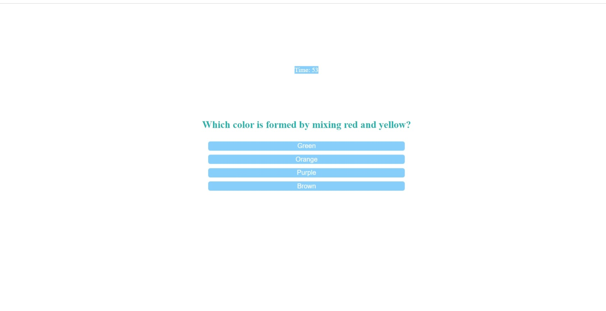

# code_quiz

## Description

Given the criteria for this project I have created a code quiz website. This website contains a timer at the top of the page and a start quiz button in the middle of the page. When you click the button a timer starts and you are presented with a question, then when you answer the question you are presented with another question. If you answer a question incorrectly then time is substracted from the timer. When all the questions are answered or the timer reaches 0, then the game is over. At the end of the game you are able to save your initials and your score. The score is based on the time left. 

## Installation
This is the link to the website: 
 https://isaiasd18.github.io/code_quiz/

## Usage

The following image shows the web application's appearance and functionality:

## Credits

Isaias Flores

## License

MIT License